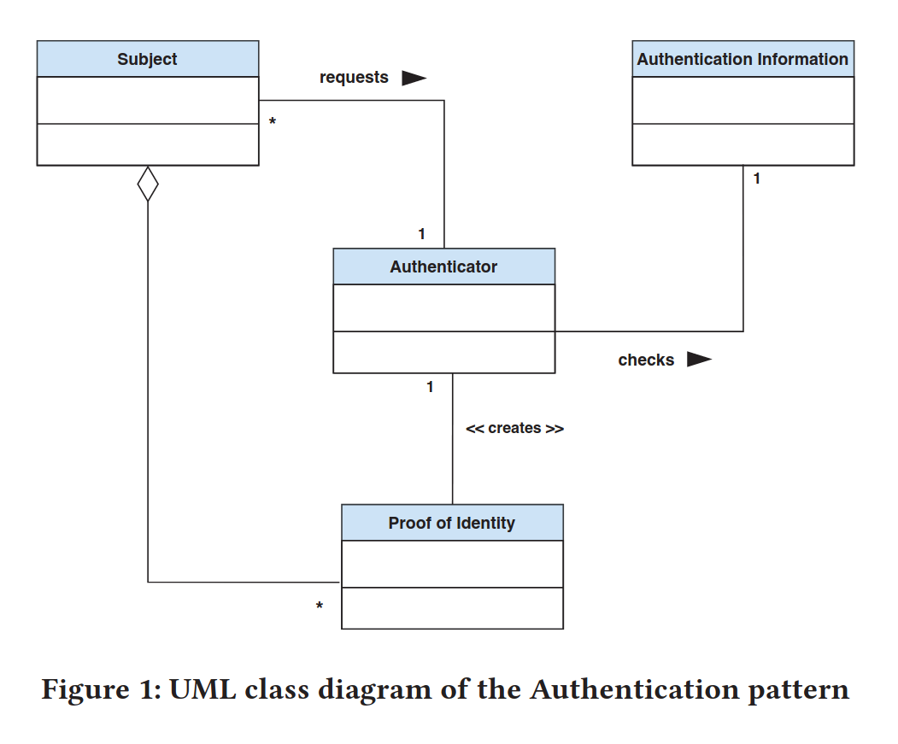
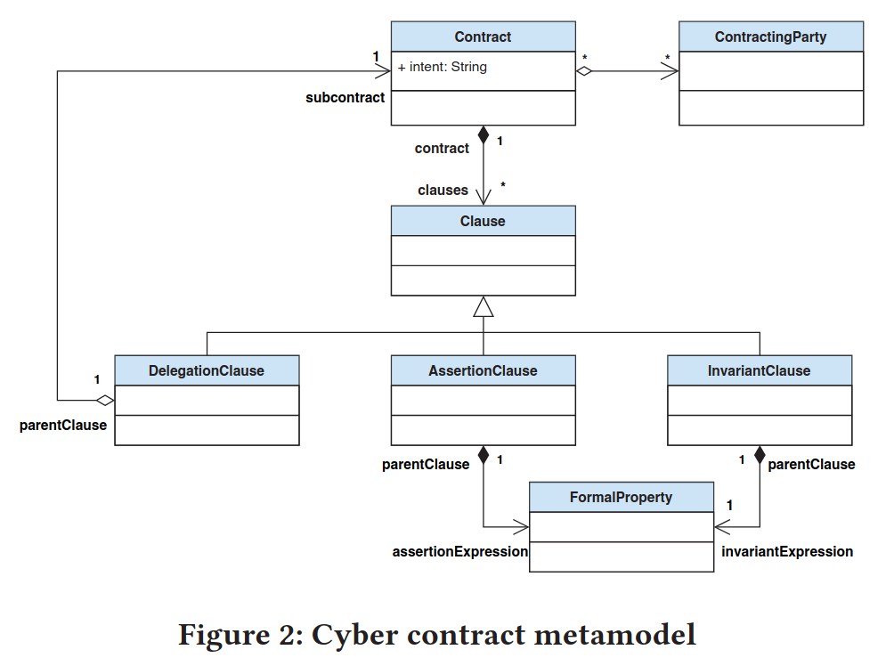

# Here is "equivalent" code der Authenticator pattern

The following is not standalone code. This is code manually extracted from different sources, to help see or construct at least one abstraction of it. A part of it might be modified from the source. Such operation could be ellicitation of code irrelevant to the present session. When such an operation happen, a *comment* is added in place to signify it. Remainder, error may happen during this operation. This means that I might forget to add a "comment", or not delete smth I identified as irrelevant.

## Fetching specifications

I don't know yet how much I will search for in the first place. This session should restrict itself to a "high-level", for instance I shouldn't seek to bring how this code is interpreted by Alloy "framework" code, Pamela "framework" or even bring in the definitions from others things such as JVM implementation, etc.

### Property One : The authentification information of subjects is unique

#### P1 English syntax

```english
% smth else
The first property to check is the uniqueness of the (authentication information, subject) pairs. This property is implicit in the pattern definition but is fundamental. Indeed, if it is not verified, the pattern has no more meaning since an authentication information would not identify a unique subject.
% smth else
```

#### P1 First-Order Logic syntax

```fol
% smth else
P1 : ∀a, b ∈ ISubject , a ≠ b =⇒ a.authInfo ≠ b.authInfo
% smth else
```

With `ISubject` being the set of all instances of the `Subject class`.

#### P1 Alloy syntax

```alloy
// smth Else
fact {
    MySubject.authInfo in {"user1" + "user2" + "user3" + "user4" + "user5" + "user6" + "user7" + "user8" + "user9" + "user10"}
}

fact idProofUniquenessPerManager { // a.k.a. P1 Uniqueness of authentication information
	{ always all s1, s2 : MySubject {
		s1 != s2 && (s1.manager = s2.manager)
		 =>
		(s1.authInfo != s2.authInfo)
		}
	}
}
// smth else
```

#### P1 Java syntax

```java
package org.openflexo.pamela.securitypatterns.authenticator.model2;
// smth else
@ModelEntity @AuthenticatorSubject(patternID = MySubject.PATTERN_ID)
public class MySubject {
	//smth else
	private String authInfo;
	// smth else
	@AuthenticationInformation(patternID = PATTERN_ID, paramID = MyAuthenticator.ID)
	public String getAuthInfo() {
		return authInfo;
	}
	// smth else
}
```

```java
package org.openflexo.pamela.securitypatterns.authenticator.annotations;

// smth else
@Retention(RetentionPolicy.RUNTIME)
@Target(value = { ElementType.METHOD, ElementType.PARAMETER })
public @interface AuthenticationInformation {
	/**
	 * @return The unique identifier of the associated Authenticator Pattern instance.
	 */
	String patternID();

	/**
	 * @return The identifier allowing the pattern to link the {@link AuthenticationInformation} getter with the
	 *         {@link RequestAuthentication} parameter.
	 */
	String paramID();
}
```

```java
package org.openflexo.pamela.securitypatterns.authenticator;
// smth else
public class AuthenticatorPatternFactory extends AbstractPatternFactory<AuthenticatorPatternDefinition> {
// smth else
	@Override
	protected void discoverMethod(Method m) {
		// smth else
		AuthenticationInformation authInfoAnnotation = m.getAnnotation(AuthenticationInformation.class);
		if (authInfoAnnotation != null) {
			AuthenticatorPatternDefinition patternDefinition = getPatternDefinition(authInfoAnnotation.patternID(), true);
			patternDefinition.authentificationInfoMethod = m;
		}
		// smth else
	}
	// smth else
}
```

```java
	/**
	 * Method checking the invariant ensuring uniqueness of the set of <code>Authentication Information</code>.
	 *
	 * @throws InvocationTargetException
	 * @throws IllegalArgumentException
	 * @throws IllegalAccessException
	 */
	private void checkAuthInfoUniqueness() throws IllegalAccessException, IllegalArgumentException, InvocationTargetException {

		AI currentAuthInfo = retrieveAuthentificationInformation();
		if (currentAuthInfo != null) {
			for (PatternInstance<AuthenticatorPatternDefinition> pi : getModelContext().getPatternInstances(getPatternDefinition())) {
				AuthenticatorPatternInstance otherInstance = (AuthenticatorPatternInstance) pi;
				AI oppositeAuthInfo = (AI) otherInstance.retrieveAuthentificationInformation();
				if (otherInstance != this) {
					if (currentAuthInfo.equals(oppositeAuthInfo)) {
						System.out.println("Tiens j'ai trouve des AuthInfo identiques");
						System.out.println("currentAuthInfo=" + currentAuthInfo);
						System.out.println("oppositeAuthInfo=" + oppositeAuthInfo);
						throw new ModelExecutionException("Subject Invariant Violation: Authentication information are not unique");
					}
				}
			}
		}
	}
```

```java
public class AuthenticatorPatternInstance<A, S, AI, PI> extends PatternInstance<AuthenticatorPatternDefinition>
		implements PropertyChangeListener {
// smth else
	private final S subject;
// smth else
	public S getSubject() {
		return subject;
	}
// smth else
	public AI retrieveAuthentificationInformation() throws IllegalAccessException, IllegalArgumentException, InvocationTargetException {
		return (AI) getPatternDefinition().authentificationInfoMethod.invoke(subject);
	}
// smth else
		@Override
	public void processMethodAfterInvoke(Object instance, Method method, Object returnValue, Object[] args)
			throws InvocationTargetException, IllegalAccessException, NoSuchMethodException {
		if (instance != getSubject()) {
			// We are only interested to the method calls on the subject
			return;
		}
		if (isChecking) {
			// Avoid stack overflow
			return;
		}
		checkAfterInvoke(instance, method, returnValue, args);
	}
// smth else
		/**
	 * Method called before after all method invoke. It performs the invariant and postcondition checks.
	 *
	 * @param method
	 *            Method which will be invoked
	 * @param returnValue
	 *            returnValue of the method
	 * @throws InvocationTargetException
	 * @throws IllegalArgumentException
	 * @throws IllegalAccessException
	 */
	void checkAfterInvoke(Object instance, Method method, Object returnValue, Object[] args)
			throws IllegalAccessException, IllegalArgumentException, InvocationTargetException {
		if (isValid()) {
			isChecking = true;
			try {
				this.checkInvariant();
				this.checkPostcondition(method, returnValue);
			} finally {
				isChecking = false;
			}
		}
	}
// smth else
	/**
	 * Method checking the <code>Authenticator Subject</code> invariant.
	 *
	 * @throws InvocationTargetException
	 * @throws IllegalArgumentException
	 * @throws IllegalAccessException
	 */
	private void checkInvariant() throws IllegalAccessException, IllegalArgumentException, InvocationTargetException {
		// smth else
		this.checkAuthInfoUniqueness();
		// smth else
	}
// smth else
}
```

```java
// smth else
public abstract class PatternInstance<P extends PatternDefinition> {
// smth else
	public P getPatternDefinition() {
		return patternDefinition;
	}
// smth else
	public PamelaMetaModel getModelContext() {
		return patternDefinition.getModelContext();
	}
// smth else
	public abstract void processMethodAfterInvoke(Object instance, Method method, Object returnValue, Object[] args)
			throws InvocationTargetException, IllegalAccessException, NoSuchMethodException;
// smth else
}
```

```java
// smth else
public class AuthenticatorPatternDefinition extends PatternDefinition {
// smth else
	public Method authentificationInfoMethod; // @AuthenticationInformation
// smth else
}
```

```java
package java.lang.reflect;
// smth else
public final class Method extends Executable {
// smth else
    @CallerSensitive
    @ForceInline // to ensure Reflection.getCallerClass optimization
    @HotSpotIntrinsicCandidate
    public Object invoke(Object obj, Object... args)
        throws IllegalAccessException, IllegalArgumentException,
           InvocationTargetException
    {
        if (!override) {
            Class<?> caller = Reflection.getCallerClass();
            checkAccess(caller, clazz,
                        Modifier.isStatic(modifiers) ? null : obj.getClass(),
                        modifiers);
        }
        MethodAccessor ma = methodAccessor; // read volatile
        if (ma == null) {
            ma = acquireMethodAccessor();
        }
        return ma.invoke(obj, args);
    }
// smth else
}
```

```java
// smth else
public abstract class PatternDefinition {
// smth else
	private final PamelaMetaModel pamelaMetaModel;
// smth else
	public PamelaMetaModel getModelContext() {
		return pamelaMetaModel;
	}
// smth else
}
```

```java
// smth else
public class PamelaMetaModel {
// smth else
	private Map<PatternDefinition, Set<PatternInstance<?>>> registeredPatternInstances = new HashMap<>();
// smth else
	public <P extends PatternDefinition> Set<PatternInstance<P>> getPatternInstances(P patternDefinition) {
		return (Set) registeredPatternInstances.get(patternDefinition);
	}
}
```

```java
public class ModelExecutionException extends RuntimeException {
	private static final long serialVersionUID = -5752071302025002810L;
	public ModelExecutionException(String message) {
		super(message);
	}
	// smth else
}
```

```java
/** Invocation handler in the core of PAMELA: main class for PAMELA interpreter<br>
 * This is the class where method call dispatching is performed.
 * @author sylvain
 * @param <I> type of object this invocation handler manages */
public class ProxyMethodHandler<I> extends IProxyMethodHandler implements MethodHandler, PropertyChangeListener {
	/** Object this invocation handler manages */
	private I object;
// smth else
	private final PAMELAProxyFactory<I> pamelaProxyFactory;
// smth else
	public PamelaModelFactory getModelFactory() {
		return pamelaProxyFactory.getModelFactory();
	}
// smth else
	@Override
	public Object invoke(Object self, Method method, Method proceed, Object[] args) throws Throwable {
// smth else
		Object invoke = null;
// smth else
		if (patternInstances != null) {
			for (PatternInstance<?> patternInstance : patternInstances) {
				try {
					patternInstance.processMethodAfterInvoke(self, method, invoke, args);
				} catch (InvocationTargetException e) {
					e.getTargetException().printStackTrace();
					for (ExecutionMonitor monitor : getModelFactory().getModelContext().getExecutionMonitors()) {
						monitor.throwingException(self, method, args, e);
					}
					throw e.getTargetException();
				}
// smth else
			}
		}
// smth else
		return invoke;
	}
// smth else
}
```

```java
/**  * The {@link PamelaModelFactory} is responsible for creating new instances of PAMELA entities.<br>
 * This class should be considered stateless, regarding to the state of handled instances.<br>
 * Note that a {@link PamelaModelFactory} might refer to an {@link EditingContext}. When so, new instances are automatically registered in
 * this {@link EditingContext}.
 * @author sylvain */
public class PamelaModelFactory {
// smth else
	private final PamelaMetaModel pamelaMetaModel;
// smth else
	private final Set<ExecutionMonitor> executionMonitors;
// smth else
	public PamelaModelFactory getModelFactory() {
		return PamelaModelFactory.this;
	}
// smth else
	public PamelaMetaModel getModelContext() {
		return pamelaMetaModel;
	}
// smth else
	public Set<ExecutionMonitor> getExecutionMonitors() {
		return this.executionMonitors;
	}
// smth else
}
```

```java
/** Interface specifying an execution monitor. Such an entity is notified every time a method is handled by the {@link org.openflexo.pamela.factory.ProxyMethodHandler}. */
public abstract class ExecutionMonitor {
// smth else
    /** Notification when throwing an exception while executing patterns on called method.
     * @param instance instance on which the method is called.
     * @param method called method.
     * @param args arguments passed to the called method.
     * @param exception exception thrown by the pattern handling. */
    public abstract void throwingException(Object instance, Method method, Object[] args, Exception exception);
// smth else
}
```

```java
/** Utility interface used to capitalize constants in the context of PAMELA interpreter (see {@link ProxyMethodHandler}
 * @author sylvain */
public class IProxyMethodHandler {
// smth else
}
```

```java
package javassist.util.proxy;
import java.lang.reflect.Method;
/** The interface implemented by the invocation handler of a proxy
 * instance.
 * @see Proxy#setHandler(MethodHandler) */
public interface MethodHandler {
    /** Is called when a method is invoked on a proxy instance associated
     * with this handler.  This method must process that method invocation.
     * @param self          the proxy instance.
     * @param thisMethod    the overridden method declared in the super class or interface.
     * @param proceed       the forwarder method for invoking the overridden method.  It is null if the overridden method is abstract or declared in the interface.
     * @param args          an array of objects containing the values of the arguments passed in the method invocation on the proxy instance.  If a parameter type is a primitive type, the type of the array element is a wrapper class.
     * @return              the resulting value of the method invocation.
     * @throws Throwable    if the method invocation fails. */
    Object invoke(Object self, Method thisMethod, Method proceed, Object[] args) throws Throwable;
}
```

```java
package java.beans;
/** A "PropertyChange" event gets fired whenever a bean changes a "bound"
 * property.  You can register a PropertyChangeListener with a source
 * bean so as to be notified of any bound property updates.
 * @since 1.1 */
public interface PropertyChangeListener extends java.util.EventListener {
    /** This method gets called when a bound property is changed.
	* @param evt A PropertyChangeEvent object describing the event source and the property that has changed. */
    void propertyChange(PropertyChangeEvent evt);
}
```

```java
package org.openflexo.pamela.factory;
// smth else
/** * Represents a partial delegate implementation, associated to a master {@link ProxyMethodHandler}<br>
 * Many partial delegate implementations might be defined for a given {@link ProxyMethodHandler}. Multiple inheritance is here implemented
 * by a composition scheme (dynamic binding at run-time)
 * @author sylvain
 * @param <I> */
public class DelegateImplementation<I> extends ProxyFactory implements MethodHandler {
// smth else
	private final ProxyMethodHandler<I> masterMethodHandler;
// smth else
	/**	 * Called when a method was invoked on delegated implementation<br>
	 * This method is strongly involved in master object dynamic binding, when partial implementations are defined. */
	@Override
	public Object invoke(Object self, Method method, Method proceed, Object[] args) throws Throwable {
		// In this case, we address an existing method in delegated implementation
		// smth else
		// We should check if this delegated implementation has a real implementation of supplied method
		// AND that method to execute is not the one of delegateImplementationClass
		if (handleMethod(method) && (method.getDeclaringClass() != delegateImplementationClass)) {
			// (The answer is yes)
			// System.out.println("We have a special impl for " + method + " in " + delegateImplementationClass);
			try {
				// Now, we must find which method in delegated implementation really implements supplied method
				return localImplementation.invoke(delegateObject, args);
			} catch (InvocationTargetException e) {
				// smth else
			}
		}
		if (proceed != null) {
			try {// Now we really invoke the method (which is a real implementation in delegated implementation)
				return proceed.invoke(self, args);
			} catch (InvocationTargetException e) {
				// smth else
			}
		} // Otherwise this method has no local implementation, forward it to the master
		else { // smth else
			if (masterObject != null) { // smth else
			} else { // Master object is not yet set, silently returns null
			// smth else
			}
		}
	}
// smth else
	public PamelaModelFactory getModelFactory() {
		return masterMethodHandler.getPamelaProxyFactory().getModelFactory();
	}
// smth else
}
```

```java
package org.openflexo.pamela.jml;
// smth else
public class SpecificationsViolationException extends RuntimeException {
	private ProxyMethodHandler<?> handler;
// smth else
}
```

```java
package org.openflexo.pamela.model.property;
//smth else
public abstract class AbstractPropertyImplementation<I, T> implements PropertyImplementation<I, T> {
	private final ProxyMethodHandler<I> handler;
// smth else
}
```

```java
package org.openflexo.pamela.model.property;
// smth else
public class DefaultSinglePropertyImplementation<I, T> extends AbstractPropertyImplementation<I, T>
		implements SinglePropertyImplementation<I, T> {
// smth else
	public DefaultSinglePropertyImplementation(ProxyMethodHandler<I> handler, ModelProperty<I> property) throws InvalidDataException {
		super(handler, property);
	}
// smth else
}
```

```java
package org.openflexo.pamela.model.property;
// smth else
public abstract class AbstractPropertyImplementation<I, T> implements PropertyImplementation<I, T> {
	private final ProxyMethodHandler<I> handler;
// smth else
}
```

#### P1 Smth else

```english
The binding with the Authenticator pattern is explicit and we can see the property P1 as an InvariantClause defined at the pattern scope. The delegation mechanism provided with the DelegateClauses is also illustrated within this example.
```

```xml
<Contract>
<binding "Authenticator_pattern" />
<clauses>
	<InvariantClause P1/>
	<Subcontract "SubjectContract">
	<binding "Subject" />
	<InvariantClause P2 ∧ P3 ∧ P4/>
		<Subcontract "authenticateContract"s>
		<binding "void authenticate()">
		< ensures P5 / >
		</ Subcontract >
	</ Subcontract >
	< Subcontract " AuthenticatorContract " >
		< binding " Authenticator " / >
		< Subcontract " requestContract " >
			< binding = " ProofOfIdentity request ( AuthenticationInformation authInfo)">
			< ensures P6 / >
		</ Subcontract >
	</ Subcontract >
	</ clauses >
</ Contract >
```

### Property Two : authentification information is immutable

#### P2 English syntax

```english
% smth else
Similarly, since the authentication information is linked to the subject instance, it must not vary during execution (probable identity theft). Let a.authInfoini be the initial value of the field authInfo of the Subject instance a.
% smth else
```

#### P2 First-Order Logic syntax

```fol
% smth else
P2 : ∀a ∈ ISubject , a.authInfo = a.authInfoini
% smth else
```

With `ISubject` being the set of all instances of the `Subject class`.

#### P2 Alloy syntax

```alloy
// smth Else
fact authenticationInformationImmutable { // a.k.a. P2 Invariance of authentication information
	{ always all s : MySubject {
		(s.authInfo = s'.authInfo)
		}
	}
}
// smth else
```

#### P2 Java syntax

```java
package org.openflexo.pamela.securitypatterns.authenticator.model2;
// smth else
@ModelEntity @AuthenticatorSubject(patternID = MySubject.PATTERN_ID)
public class MySubject {
	//smth else
	private String authInfo;
	// smth else
	@AuthenticationInformation(patternID = PATTERN_ID, paramID = MyAuthenticator.ID)
	public String getAuthInfo() {
		return authInfo;
	}
	// smth else
}
```

```java
package org.openflexo.pamela.securitypatterns.authenticator.annotations;
// smth else
@Retention(RetentionPolicy.RUNTIME) @Target(value = { ElementType.METHOD, ElementType.PARAMETER })
public @interface AuthenticationInformation {
	/** @return The unique identifier of the associated Authenticator Pattern instance. */
	String patternID();
	/** @return The identifier allowing the pattern to link the {@link AuthenticationInformation} getter with the {@link RequestAuthentication} parameter. */
	String paramID();
}
```

```java
package org.openflexo.pamela.securitypatterns.authenticator;
// smth else
public class AuthenticatorPatternFactory extends AbstractPatternFactory<AuthenticatorPatternDefinition> {
// smth else
	@Override
	protected void discoverMethod(Method m) {
		// smth else
	}
	// smth else
}
```

Until here, there's no difference with the previous property.

```java
package org.openflexo.pamela.securitypatterns.authenticator;
// smth else
public class AuthenticatorPatternInstance<A, S, AI, PI> extends PatternInstance<AuthenticatorPatternDefinition>
		implements PropertyChangeListener {
// smth else
	private AI authInfo;
	/**
	 * Method checking the invariant ensuring all <code>Authentication Information</code> does not change throughout runtime.
	 */
	private void checkAuthInfoIsFinal() {
		try {
			AI currentAuthInfo = retrieveAuthentificationInformation();
			if (authInfo != null && currentAuthInfo != authInfo) {
				System.out.println("Was: " + authInfo + " is now " + currentAuthInfo);
				throw new ModelExecutionException(
						"Subject Invariant Violation: Authentication Information has changed since initialization");
			}
		} catch (IllegalAccessException | InvocationTargetException e) {
			e.printStackTrace();
			System.exit(1);
		}
	}
}
```

The above code is different from P1 uniqueness, as it compares the initial value of `authInfo` that was initialized when starting the application with the value of `authInfo` retrieved when necessary.

The rest of the code is the same and is therefore omitted here.

### Property Three : Authenticator is immutable

#### P3 English syntax

```english
% smth else
A major flaw that can jeopardize authentication systems concerns the non-integrity of the authentication authority. In order to be authenticated, a subject must make a request to the Authenticator. If an attacker succeeds in forging its Authenticator, he becomes master of the authentication system. It is therefore essential that the Authenticator cannot be modified. Thus, let a.authenticatorini be the initial value of the field authenticator of the Subject instance a.
% smth else
```

#### P3 First-Order Logic syntax

```fol
% smth else
P3 : ∀a ∈ ISubject , a.authenticator = a.authenticator_ini
% smth else
```

With `ISubject` being the set of all instances of the `Subject class`.

#### P3 Alloy syntax

```alloy
// smth Else
fact authenticatorIsImmutable { // a.k.a P3 Invariance of authenticator
	{ always all s : MySubject {
		(s.manager = s'.manager)
	 	}
	}
}
// smth else
```

#### P3 Java syntax

```java
package org.openflexo.pamela.securitypatterns.authenticator.model2;
// smth else
@ModelEntity @AuthenticatorSubject(patternID = MySubject.PATTERN_ID)
public class MySubject {
	//smth else
	private MyAuthenticator manager;
	// smth else
	@AuthenticatorGetter(patternID = PATTERN_ID)
	public MyAuthenticator getManager() {
		return manager;
	}
	// smth else
}
```

This is using another annotation to signify this.

```java
import org.openflexo.pamela.annotations.Getter;
// smth else
@Retention(RetentionPolicy.RUNTIME) @Target(value = { ElementType.METHOD, ElementType.PARAMETER })
public @interface AuthenticatorGetter {
	/** @return The unique identifier of the associated Authenticator Pattern instance. */
	String patternID();
}
```

Which is also handled in the generic function below.

```java
package org.openflexo.pamela.securitypatterns.authenticator;
// smth else
public class AuthenticatorPatternFactory extends AbstractPatternFactory<AuthenticatorPatternDefinition> {
// smth else
	@Override
	protected void discoverMethod(Method m) {
		// smth else
		AuthenticatorGetter authenticatorGetterAnnotation = m.getAnnotation(AuthenticatorGetter.class);
		if (authenticatorGetterAnnotation != null) {
			AuthenticatorPatternDefinition patternDefinition = getPatternDefinition(authenticatorGetterAnnotation.patternID(), true);
			patternDefinition.authenticatorGetterMethod = m;
		}
		// smth else
	}
	// smth else
}
```

```java
package org.openflexo.pamela.securitypatterns.authenticator;
// smth else
public class AuthenticatorPatternInstance<A, S, AI, PI> extends PatternInstance<AuthenticatorPatternDefinition>
		implements PropertyChangeListener {
	// smth else
	private A authenticator;
	//smth else
	/** Method checking the invariant ensuring the <code>authenticator</code> does not change throughout runtime. */
	private void checkAuthenticatorIsFinal() {
		try {
			A currentAuthenticator = retrieveAuthenticator();
			if (currentAuthenticator != authenticator) {
				throw new ModelExecutionException("Subject Invariant Violation: Authenticator has changed since initialization");
			}
		} catch (IllegalAccessException | InvocationTargetException e) {
			e.printStackTrace();
			System.exit(1);
		}
	}
	// smth else
	private A retrieveAuthenticator() throws IllegalAccessException, IllegalArgumentException, InvocationTargetException {
		return (A) getPatternDefinition().authenticatorGetterMethod.invoke(subject);
	}
}
```

```java
// smth else
public class AuthenticatorPatternDefinition extends PatternDefinition {
// smth else
	public Method authenticatorGetterMethod; // @AuthenticatorGetter
// smth else
}
```

Which is calling the method identifying the `authenticator` in the `Subject`. This is possible because the methods has been annotated with such an annotation and was then "retrieved" with the same code as for other annotation of a pattern, that is `discoverMethod(Method)`.

```java
package org.openflexo.pamela.securitypatterns.authenticator;
// smth else
public class AuthenticatorPatternFactory extends AbstractPatternFactory<AuthenticatorPatternDefinition> {
	// smth else
	@Override
	protected void discoverMethod(Method m) {
		// smth else
		AuthenticatorGetter authenticatorGetterAnnotation = m.getAnnotation(AuthenticatorGetter.class);
		if (authenticatorGetterAnnotation != null) {
			AuthenticatorPatternDefinition patternDefinition = getPatternDefinition(authenticatorGetterAnnotation.patternID(), true);
			patternDefinition.authenticatorGetterMethod = m;
		}
		//smth else
	}
	//smth else
}
```

```java
package org.openflexo.pamela.securitypatterns.authenticator.annotations;
// smth else
@Retention(RetentionPolicy.RUNTIME)@Target(value = ElementType.METHOD)
public @interface AuthenticatorGetter {
	/** @return The unique identifier of the associated Authenticator Pattern instance.	 */
	String patternID();
}
```

```java
package org.openflexo.pamela.securitypatterns.authenticator;
//smth else
public class AuthenticatorPatternInstance<A, S, AI, PI> extends PatternInstance<AuthenticatorPatternDefinition>
		implements PropertyChangeListener {
	// smth else
	private A authenticator;
	private boolean isChecking = false;
	//smth else
	private A retrieveAuthenticator() throws IllegalAccessException, IllegalArgumentException, InvocationTargetException {
		return (A) getPatternDefinition().authenticatorGetterMethod.invoke(subject);
	}
	private void checkAuthenticator() {
		isChecking = true;
		A retrievedAuthenticator;
		try {
			retrievedAuthenticator = retrieveAuthenticator();
			if (authenticator == null && retrievedAuthenticator != null) {
				authenticator = retrievedAuthenticator;
				registerStakeHolder(authenticator, AuthenticatorPatternDefinition.AUTHENTICATOR_ROLE);
			}
		} catch (Exception e) {
			e.printStackTrace();
		}
		isChecking = false;
	}
	// smth else
}
```

```java
package org.openflexo.pamela.patterns;
// smth else
public abstract class PatternInstance<P extends PatternDefinition> {
	private P patternDefinition;
	// smth else
	protected void registerStakeHolder(Object stakeHolder, String role) {
			patternDefinition.getModelContext().registerStakeHolderForPatternInstance(stakeHolder, role, this);
	}
	//smth else
}
```

```java
package org.openflexo.pamela;
//smth else
public class PamelaMetaModel {
	//smth else
	private Map<Object, Set<PatternInstance<?>>> patternInstances = new HashMap<>();
	//smth else
	public void registerStakeHolderForPatternInstance(Object stakeHolder, String role, PatternInstance<?> patternInstance) {
		Set<PatternInstance<?>> s = patternInstances.get(stakeHolder);
		if (s == null) {
			s = new HashSet<>();
			patternInstances.put(stakeHolder, s);
		}
		System.out.println("Registering " + stakeHolder + " as " + role + " for pattern instance " + patternInstance);
		s.add(patternInstance);
	}
	//smth else
}
```

```java
package org.openflexo.pamela.securitypatterns.authenticator;
//smth else
public class AuthenticatorPatternDefinition extends PatternDefinition {
	//smth else
	public Method authenticatorGetterMethod; // @AuthenticatorGetter
	//smth else
	@Override
	public boolean isMethodInvolvedInPattern(Method method) {
		if (// smth else
				|| PamelaUtils.methodIsEquivalentTo(method, authenticatorGetterMethod)
			//smth else
			) { return true; }
		if (method.getAnnotation(RequiresAuthentication.class) != null) {return true;}
		try {
			Method apiMethod = subjectModelEntity.getImplementedInterface().getMethod(method.getName(), method.getParameterTypes());
			if (apiMethod.getAnnotation(RequiresAuthentication.class) != null) {return true;}
		} catch (NoSuchMethodException e) {// Not found
		}
		return super.isMethodInvolvedInPattern(method);
	}
	//smth else
}
```

The rest of the generic handling code is the same and is therefore omitted here.

### Property Four : Proof of Identity is valid or undefined

Differently from above, I will finish this section with the Alloy syntax.

#### P4 English syntax

```english
% smth else
At all time, the proof of identity of every subject must be either valid or undefined.
% smth else
```

#### P4 First-Order Logic syntax

```fol
% smth else
P4 : ∀a ∈ ISubject , (a.idProof = ∅) \/ (a.idProof = a.authenticator.request (a.authInfo))
% smth else
```

With `ISubject` being the set of all instances of the `Subject class`.

#### P4 Java syntax

```java
package org.openflexo.pamela.securitypatterns.authenticator.model2;
//smth else
@ModelEntity @AuthenticatorSubject(patternID = MySubject.PATTERN_ID)
public class MySubject {
	//smth else
	public static final String ID_PROOF = "id_proof";
	private int idProof = -1;
	//smth else
	@ProofOfIdentityGetter(patternID = PATTERN_ID)
	public int getIDProof() {
		return idProof;
	}
	@ProofOfIdentitySetter(patternID = PATTERN_ID)
	public void setIDProof(int idProof) {
		this.idProof = idProof;
	}
	@AuthenticateMethod(patternID = PATTERN_ID)
	public void authenticate() {
		setIDProof(getManager().request(getAuthInfo()));
	}
	//smth else
}
```

This property uses at leat three annotation identified above all located in the same package.

```java
package org.openflexo.pamela.securitypatterns.authenticator.annotations;
```

```java
@Retention(RetentionPolicy.RUNTIME) @Target(value = ElementType.METHOD)
public @interface ProofOfIdentityGetter {
	/** @return The unique identifier of the associated Authenticator Pattern instance.*/
	String patternID();
}
```

```java
@Retention(RetentionPolicy.RUNTIME) @Target(value = ElementType.METHOD)
public @interface ProofOfIdentitySetter {
	/** @return The unique identifier of the associated Authenticator Pattern instance.*/
	String patternID();
}
```

```java
@Retention(RetentionPolicy.RUNTIME) @Target(value = ElementType.METHOD)
public @interface AuthenticateMethod {
	/**@return The unique identifier of the associated Authenticator Pattern instance.*/
	String patternID();
}
```

```java
package org.openflexo.pamela.securitypatterns.authenticator;
//smth else
public class AuthenticatorPatternFactory extends AbstractPatternFactory<AuthenticatorPatternDefinition> {
	//smth else
	@Override
	protected void discoverMethod(Method m) {
		// smth else
		ProofOfIdentitySetter proofOfIdentitySetterAnnotation = m.getAnnotation(ProofOfIdentitySetter.class);
		if (proofOfIdentitySetterAnnotation != null) {
			AuthenticatorPatternDefinition patternDefinition = getPatternDefinition(proofOfIdentitySetterAnnotation.patternID(), true);
			patternDefinition.proofOfIdentitySetterMethod = m;
		}
		ProofOfIdentityGetter proofOfIdentityGetterAnnotation = m.getAnnotation(ProofOfIdentityGetter.class);
		if (proofOfIdentityGetterAnnotation != null) {
			AuthenticatorPatternDefinition patternDefinition = getPatternDefinition(proofOfIdentityGetterAnnotation.patternID(), true);
			patternDefinition.proofOfIdentityGetterMethod = m;
		}
		AuthenticateMethod authenticateMethodAnnotation = m.getAnnotation(AuthenticateMethod.class);
		if (authenticateMethodAnnotation != null) {
			AuthenticatorPatternDefinition patternDefinition = getPatternDefinition(authenticateMethodAnnotation.patternID(), true);
			patternDefinition.authenticateMethod = m;
		}
	}
}
```

The instructions specific to P4 is as below :

```java
package org.openflexo.pamela.securitypatterns.authenticator;
//smth else
public class AuthenticatorPatternInstance<A, S, AI, PI> extends PatternInstance<AuthenticatorPatternDefinition>
		implements PropertyChangeListener {
	//smth else
	private PI proofOfIdentity;
	private PI defaultIdProof;
	private boolean isChecking = false;
	private boolean isAuthenticating = false;
	// smth else
	/*** Method checking the <code>Authenticator Subject</code> invariant.*
	 * @throws InvocationTargetException* @throws IllegalArgumentException* @throws IllegalAccessException */
	private void checkInvariant() throws IllegalAccessException, IllegalArgumentException, InvocationTargetException {
		// smth else
/*#1*/		this.checkIdProofIsValid();
		//smth else
	}
	/** * Method checking the invariant preventing <code>Proof of Identity</code> forgery. */
	private void checkIdProofIsValid() {
/*#2*/		try {if (isAuthenticated() && !isAuthenticating) { 
/*#3*/				PI currentProof = retrieveProofOfIdentity();
/*#4*/				if (!proofOfIdentity.equals(currentProof)) {
/*#5*/					if ((proofOfIdentity == null && !currentProof.equals(defaultIdProof)) || (proofOfIdentity != null && !currentProof.equals(proofOfIdentity) && !currentProof.equals(this.defaultIdProof))) { throw new ModelExecutionException("Subject Invariant Violation: Proof of identity has been forged");}}}
/*#6*/		} catch (IllegalAccessException | InvocationTargetException e) {e.printStackTrace();}
	}
	/*** Performs the authentication of the given instance.* 
	 * @throws InvocationTargetException* @throws IllegalArgumentException* @throws IllegalAccessException */
	void performAuthentication() throws IllegalAccessException, IllegalArgumentException, InvocationTargetException {
		isAuthenticating = true;
		try {proofOfIdentity = (PI) getPatternDefinition().requestAuthentificationMethod.invoke(authenticator,retrieveAuthentificationInformation());
			setProofOfIdentity(proofOfIdentity);
			if (proofOfIdentity != null) {
				isAuthenticated = true; authenticationSuceeded();}
		} finally {isAuthenticating = false;}
	}
	/*** Method checking the postconditions, if any, after the <code>method</code> invoke
	 * @param method Just-invoked method @param returnValue Return Value of the invoked method */
	private void checkPostcondition(Method method, Object returnValue) {
		if (PamelaUtils.methodIsEquivalentTo(method, getPatternDefinition().authenticateMethod)) {
			if (proofOfIdentity == null) {
				throw new ModelExecutionException(String.format("Subject authenticate method postcondition violation (Pattern %s, Class %s)",getPatternDefinition().getIdentifier(), getPatternDefinition().subjectModelEntity.getImplementedInterface()));}}
	}
	public boolean isAuthenticated() {
		return isAuthenticated;
	}
	public PI retrieveProofOfIdentity() throws IllegalAccessException, IllegalArgumentException, InvocationTargetException {
		return (PI) getPatternDefinition().proofOfIdentityGetterMethod.invoke(getSubject());
	}
	/*** Method called before every method of interest is about to be invoked. Performs the execution, if relevant.* * @param instance Object on which the method is called @param method Called method @param args
	 * @return a {@link ReturnWrapper} wrapping true if the execution of the invoke should go one after the call, false if not.
	 * @throws InvocationTargetException if an error occurred when internally invoking a method * @throws IllegalAccessException if an error occurred when   invoking a method * @throws NoSuchMethodException if an error occurred when internally invoking a method */
	@Override
	public ReturnWrapper processMethodBeforeInvoke(Object instance, Method method, Object[] args) throws InvocationTargetException, IllegalAccessException, NoSuchMethodException {
		System.out.println("On utilise bien le processMethodBeforInvoke");
		if (instance != getSubject()) {// We are only interested to the method calls on the subject
			return new ReturnWrapper(true, null);}
		if (isChecking) {// Avoid stack overflow
			return new ReturnWrapper(true, null);}
		checkBeforeInvoke(instance, method, args);
		if (PamelaUtils.methodIsEquivalentTo(method, getPatternDefinition().authenticateMethod)) {
			if (isValid()) {System.out.println("On passe PerformAuthentication normalement");
				performAuthentication();
			return new ReturnWrapper(false, null);}}
		//smth else
		return new ReturnWrapper(true, null);
	}
}
```

1. We can observe that the definition is not trivial.
2. There's a kind of "separation of concerns" used in here to help the implementation of this property.

I will try to (re)state in my own terms a trace of the above code :
* #1, Checking that Proof of Identity is Valid or Undefined require to :
  	* #2, Check if the subject is authenticated and is not try to perform an authentication
      	1. #3, In the first case, we get the "initial" ProofOfIdentity (POI_ini) (hiding the reflection being made here)
    	2. #4,5 Then match the POI_ini with the current value.
		3. In case of a mismatch the function return the element that makes it complete.

At #6 We can observe a side effet might happen coming from composition.

The code below is initializing the ProofOfIdentity in the `PamelaMetaModel`.

```java
package org.openflexo.pamela.securitypatterns.authenticator;
// smth else
public class AuthenticatorPatternDefinition extends PatternDefinition {
	//smth else
	public Method proofOfIdentityGetterMethod; // derived property
	public Method proofOfIdentitySetterMethod; // @ProofOfIdentitySetter
	public Method authenticateMethod; // @AuthenticateMethod
	//smth else
	@Override
	public void finalizeDefinition() throws ModelDefinitionException {
		if (proofOfIdentityGetterMethod == null) {
			// attempt to retrieve it
			Iterator properties = subjectModelEntity.getProperties();
			while (properties.hasNext()) {
				ModelProperty<?> p = (ModelProperty<?>) properties.next();
				if (PamelaUtils.methodIsEquivalentTo(proofOfIdentitySetterMethod, p.getSetterMethod())) {
					proofOfIdentityGetterMethod = p.getGetterMethod();
				}
			}
		}
		if (proofOfIdentityGetterMethod == null) {
			throw new ModelDefinitionException("No getter for Proof of identity in " + subjectModelEntity.getImplementedInterface());
		}
	}
	@Override
	public boolean isMethodInvolvedInPattern(Method method) {
		if (//...
			|| PamelaUtils.methodIsEquivalentTo(method, proofOfIdentitySetterMethod)
			|| PamelaUtils.methodIsEquivalentTo(method, authenticateMethod)
			//...
			) {return true;}
		//...
		return super.isMethodInvolvedInPattern(method);
	}
	//...
}
```

#### P4 Alloy syntax

Loosely equivalent to above implementation is as follows :
1. Creating a boolean value `isAuthenticated`.
2. Suppose that it's always true and make it appear.
3. Skip the "perform authentication" for now.

```alloy
//..
some sig MySubject {
	//..
	var idProof : one Int,
	var isAuthenticated : True,
	//..
}
//...
fact {
    MySubject.idProof in {0+1+2+3+4+5+6+7+8+9}
}
//...
fact proofOfIdentityIsValid { // a.k.a P4 Validity of the Proof of Identity
	{ always all s : MySubject {
		s.isAuthenticated = True
		and (s.idProof = none) or (s.idProof = expectedProof[s.authInfo])
		}
	}
}
fun expectedProof : String -> one Int {
  "user1" -> 1 + "user2" -> 2 + "user3" -> 3 + "user4" -> 4 + "user5" -> 5 + "user6" -> 6 + "user7" -> 7 + "user8" -> 8 + "user9" -> 9 + "user10" -> 0
}
//...
```

The above code is probably incorrect, its commented at the moment.

## Functions that applies to all above

```java
package org.openflexo.pamela.securitypatterns.authenticator;
//smth else
public class AuthenticatorPatternInstance<A, S, AI, PI> extends PatternInstance<AuthenticatorPatternDefinition>
		implements PropertyChangeListener {
	//smth else
	private boolean isChecking = false;
	private final S subject;
	private PI proofOfIdentity;
	private PI defaultIdProof;
	private boolean isAuthenticating = false;
	// smth else
	/*** Method called before all method invoke. It performs the invariant and precondition checks. * @param method Method which will be invoked * @throws InvocationTargetException @throws IllegalArgumentException @throws IllegalAccessException */
	void checkBeforeInvoke(Object instance, Method method, Object[] args) throws IllegalAccessException, IllegalArgumentException, InvocationTargetException {
		if (isValid()) { isChecking = true;
			try { checkInvariant(); checkPreconditions(method);}
			finally {isChecking = false;}}
	}
	//...
	@Override
	public void processMethodAfterInvoke(Object instance, Method method, Object returnValue, Object[] args) throws InvocationTargetException, IllegalAccessException, NoSuchMethodException {
		if (instance != getSubject()) {/* We are only interested to the method calls on the subject*/ return;}
		if (isChecking) {/*Avoid stack overflow*/ return;}
		checkAfterInvoke(instance, method, returnValue, args);
	}
	/** Method called before after all method invoke. It performs the invariant and postcondition checks.*
	 * @param method Method which will be invoked @param returnValue returnValue of the method
	 *  @throws InvocationTargetException @throws IllegalArgumentException @throws IllegalAccessException */
	void checkAfterInvoke(Object instance, Method method, Object returnValue, Object[] args) throws IllegalAccessException, IllegalArgumentException, InvocationTargetException {
		if (isValid()) { isChecking = true;
			try {this.checkInvariant(); this.checkPostcondition(method, returnValue);}
			finally { isChecking = false;}}
	}
	/*** Method checking the preconditions, if any, before the <code>method</code> invoke *  @param method Method to be invoked after check */
	private void checkPreconditions(Method method) {/*empty body*/}
	public boolean isValid() { return subject != null && getAuthenticator() != null;}
	public S getSubject() { return subject; }
}
```

## Auxilliary methods

```java
package org.openflexo.pamela.factory;
//smth else
public class PamelaUtils {
	/*** Return boolean indicating if supplied methods are equivalent* * @param method * @param to * @return */
	public static boolean methodIsEquivalentTo(@Nonnull Method method, @Nullable Method to) {
		if (to == null) { return method == null; }
		return method.getName().equals(to.getName())/* && method.getReturnType().equals(to.getReturnType())*/
				&& Arrays.equals(method.getParameterTypes(), to.getParameterTypes());
	}
	//smth else
}
```


## See also





## Comments

What concepts are being used ?
	- Previously mentionned concept are `Entity`, `Formula` et `Property`.
	- Entity has :
    	- a name,
    	- a Kind,
    	- List of :
        	- Property,
        	- Formula.
  	- Formula is an expression,
  	- Property has :
    	- a name,
    	- a type,
    	- a cardinality (default:one).
	- a Kind is a :
    	- JavaKind
    	- AlloyKind
  	- a JavaKind is a :
    	- Class,
    	- Interface,
    	- Annotation Type.
  	- a AlloyKind is a :
    	- Signature,
    	- Fact,
    	- Predicate,
    	- Function.

What links are made ?

Thus far I haven't talked about the `manager`.